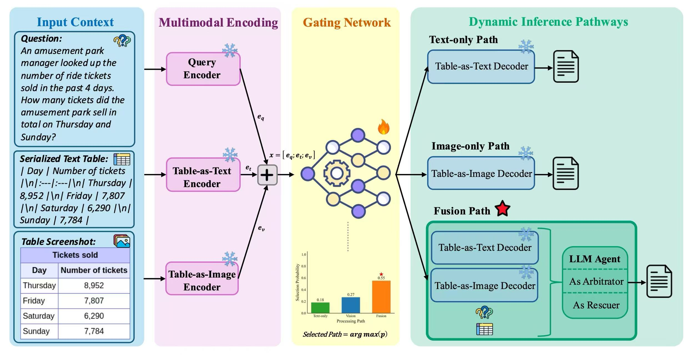

# TableDART: Dynamic Adaptive Multi-Modal Routing for Table Understanding

**Source code for paper:** *TableDART: Dynamic Adaptive Multi-Modal Routing for Table Understanding* (Accepted in ICLR 2026) 

[](https://arxiv.org/abs/2509.14671)
[](https://openreview.net/forum?id=4aZTiLH3fm)
[](https://huggingface.co/XiaoboX/TableDART)
[](LICENSE)

## Table of Contents
1. [Introduction](#introduction)
2. [Dataset Description](#dataset-description)
3. [Training](#training)
4. [Inference](#inference)
5. [Evaluation](#evaluation)
6. [Citation](#citation)
7. [License](#license)
8. [Acknowledgments](#acknowledgments)


---
## Introduction
Modeling semantic and structural information from tabular data remains a core challenge for effective table understanding. Existing LLM-based table understanding methods face a fundamental dilemma: Table-as-Text approaches flatten tables into textual sequences, but inevitably lose crucial structural cues; Table-as-Image methods preserve the visual structure, yet struggle to capture precise semantic information; Recent Table-as-Multimodality strategies attempt to combine textual and visual views through large multimodal language models (MLLMs), but they statically process all modalities for every query-table pair regardless of their utility, inevitably introducing redundancy and potential conflicts when textual and visual representations provide inconsistent cues. Furthermore, these approaches depend on costly fine-tuning of MLLMs, limiting their practical applicability.

To address this challenge, we propose **TableDART**, a training-efficient framework that integrates multimodal views by reusing pretrained single-modality expert models while keeping them frozen. We learn only a lightweight **2.59M-parameter MLP gating network** that dynamically selects the optimal path (Text-only, Image-only, or Fusion) for each table-query pair, effectively reducing redundancy and avoiding conflicts. Additionally, we introduce an intelligent LLM agent-based approach that mediates cross-modal knowledge integration by analyzing outputs from text and image models, either selecting the best result or synthesizing a new answer through reasoning over potentially inconsistent or incomplete fragments from different modalities. This training-efficient design requires fine-tuning of merely 2.59M parameters while keeping all pretrained single-modality models frozen, thereby avoiding the prohibitive costs of full LLM/MLLM fine-tuning while achieving competitive or superior performance.

Extensive experiments on seven benchmarks demonstrate that TableDART achieves state-of-the-art performance on 4 out of 7 benchmarks among open-source models, surpassing the strongest baseline by an average of **4.02%**, while maintaining significant computational efficiency gains.

<p align="center">
  
</p>


## Dataset Description
We evaluate on 7 table understanding benchmarks, including MMTab and related datasets.
### Data Preparation
1) **Install Dependencies**
    - `conda create -n tabledart python=3.10`
    - `conda activate tabledart`
    - `pip install -r requirements.txt`

2) **Configuration**
    - Copy the provided credential template: `cp env.txt .env`, then fill in keys such as `GEMINI_API_KEY` and `HF_TOKEN`.
    - Edit `project_config/config.py` such as dataset paths, table image directories, output folders, API models, and checkpoints，etc.

### Data Download and Processing
1) **Data Download.** Download the publicly available MMTab Dataset.
    ```bash
    # train
    wget https://huggingface.co/datasets/SpursgoZmy/MMTab/resolve/main/MMTab-instruct_table_images_82K.zip
    mv MMTab-instruct_table_images_82K.zip
    unzip MMTab-instruct_table_images_82K.zip

    # test
    wget https://huggingface.co/datasets/SpursgoZmy/MMTab/resolve/main/MMTab-eval_table_images_23K.zip
    mv MMTab-eval_table_images_23K.zip hippo/
    unzip MMTab-eval_table_images_23K.zip
    ```

2) **Create mixed training/validation splits**. Regenerate the mixed data with:
   ```bash
   python data/create_mixed_dataset.py \
     --input_file data/your_data_path/train_data.jsonl \
     --output_dir data/your_data_path \
     --samples_per_dataset 2000 \
     --val_ratio 0.15
   ```
   - The script pulls dataset names from `cfg["DATA"]["MIXED_DATASETS"]` and writes `mixed_train.jsonl`, `mixed_val.jsonl`, and `dataset_summary.json` under `data/processed_datasets/`
   - Sampling uses a fixed random seed (42) in code for reproducibility. 
  
    After generating or directly using our mixed dataset, point `TRAIN_PATH` and `VAL_PATH` in `project_config/config.py` to the generated files.

---

## Training

You can directly use our pretrained gating network checkpoint at `checkpoints/LAMBDA_RESOURCE_LOSS_0.15/best_model_gate.pth`, or train the gating network from scratch following the steps below.

### Cost Vector Measurement 
Measure the cost vector before training (our measured result is provided at `cost_measurement/expert_costs.json`):
  ```bash
  python cost_measurement/measure_expert_costs.py \
    --save_results \
    --output_file cost_measurement/expert_costs.json
  ```
  - The script loads the test split and table images configured in `project_config/config.py`, benchmarks each model, logs latency/TTFT/throughput statistics, and writes `cost_measurement/expert_costs.json`. 
  - Copy the reported values into `cfg["MODEL"]["EXPERT_COSTS"]` for training and inference.

### Train the Gating Network
Start to train the gating network by running: 
```bash
python train.py
```
  - Checkpoints and plots will appear in `checkpoints/Mixed_Dataset_Training/` (configurable via `cfg["TRAINING"]["CHECKPOINT_DIR"]`).
  - ⭐️ We provide our trained gating network checkpoint:
    - Local path: `checkpoints/LAMBDA_RESOURCE_LOSS_0.15/best_model_gate.pth`. 
    - Hugging Face Model Hub: https://huggingface.co/XiaoboX/TableDART
  - (Optional) Update `cfg["TRAINING"]["INFERENCE_CHECKPOINT"]` to your checkpoint path so evaluation scripts pick it up automatically.

---

## Inference

Standard run: 
```bash
python inference.py
```

With efficiency measurement: 
```bash
python inference.py --measure_efficiency
```
  - Outputs are written to `cfg["DATA"]["INFERENCE_OUTPUT_DIR"]` (default `output/main/`).

---

## Evaluation

Run evaluation with:
```bash
python evaluation/MMTab_evaluation.py
```

---

## Citation

If you use TableDART in your research, please cite and consider starring this repository. Many thanks!

**ICLR 2026 Version:**
```bibtex
@inproceedings{xing2026tabledart,
    title={Table{DART}: Dynamic Adaptive Multi-Modal Routing for Table Understanding},
    author={Xiaobo Xing and Wei Yuan and Tong Chen and Quoc Viet Hung Nguyen and Xiangliang Zhang and Hongzhi Yin},
    booktitle={The Fourteenth International Conference on Learning Representations},
    year={2026},
    url={https://openreview.net/forum?id=4aZTiLH3fm}
}
```

**ArXiv Version:**
```bibtex
@misc{xing2025tabledartdynamicadaptivemultimodal,
    title={TableDART: Dynamic Adaptive Multi-Modal Routing for Table Understanding}, 
    author={Xiaobo Xing and Wei Yuan and Tong Chen and Quoc Viet Hung Nguyen and Xiangliang Zhang and Hongzhi Yin},
    year={2025},
    eprint={2509.14671},
    archivePrefix={arXiv},
    primaryClass={cs.CL},
    url={https://arxiv.org/abs/2509.14671}
}
```

## License
This project is licensed under the [MIT License](LICENSE).

## Acknowledgments
This work benefits from the previous excellent work of [TableGPT2](https://github.com/tablegpt/tablegpt-agent), [Ovis2](https://github.com/AIDC-AI/Ovis), [Qwen2.5-VL](https://huggingface.co/collections/Qwen/qwen2.5-vl), and [Gemini 2.0 Flash](https://docs.cloud.google.com/vertex-ai/generative-ai/docs/models/gemini/2-0-flash).
